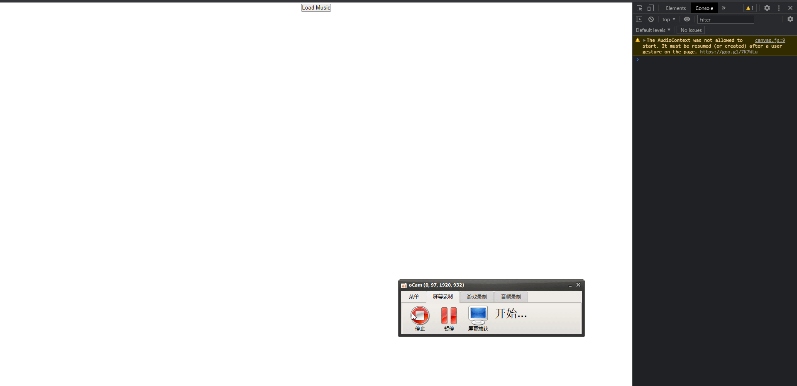

# Canvas学习记录

## 资料来源/参考

  - `<<HTML5 Canvas核心技术 图形、动画与游戏开发>>`

## 项目目标

  - 完成`canvas`基础知识的学习
  - 了解canvas高级知识
  - 做一些好玩的事情，交互等
    - 比如球体之间的碰撞
    - 坦克大战中的移动

## 学习/完成进度
  - Chapter1
    - 收获
    
      从这个章节学到了什么方法，接口，绘图技巧等等

    - 思考

      canvas对脏数据的处理是什么逻辑等等

    - 好玩的`例子/问题`?

      100个球在围墙内运动，如何让球发生碰撞

  - Chapter2

    - 好玩的`例子/问题`
      - 剪纸效果——非零环绕原则 + path

## 什么是非零环绕原则

## Demo

 * Music Dance
  